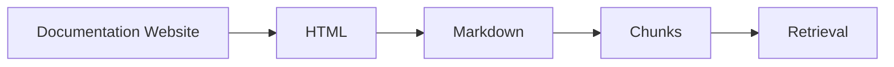

# Why Fetching Documentation for Context Engineering is Hard
<Hero :title="empty_string" :subtitle="prettyDate(subtitle)"/>
<Share :title="title" :shortDescription="shortDescription" :tags="tags"/>

When building integrations using AI, one of the toughest engineering problems is turning third-party documentation into reliable context for agents. Whether the target is a CRM, a payments gateway, or a legacy ERP, the agent needs precise details: valid endpoints, input/output formats, headers, error semantics. If the model can't see the right snippets at runtime, it will guess - and guesses break production.

## The documentation–LLM ingestion challenge

Documentation comes in many shapes: polished Mintlify sites, Swagger UIs, GraphQL playgrounds, old OpenAPI specs, or PDF manuals. For humans, reading docs is intuitive - you scan examples, check authentication, and test an endpoint. For LLMs, every format introduces a new obstacle. A model can rely on training data - thousands of examples for common tasks like creating an invoice in Stripe - but likely has very few references for newer endpoints, like the recently released OpenAI Responses API, or for niche systems such as a decade-old ERP.

It might seem that giving the LLM a web-search tool would solve the problem, but that alone isn't sufficient. Modern documentation has become increasingly visual and interactive - dynamic code examples, JS-rendered components, language toggles. They look great, but make scraping and parsing much harder. Big docs (like AWS's hundreds of pages) can't just be dumped into the context; only the *relevant* parts matter. And with scraping protections or headless-browser blocks, even fetching those parts can fail. Swagger UIs and GraphQL playgrounds are especially tricky since their content loads only after user interaction.

[Context7's](https://context7.com/) community-driven approach to user-generated documentation is interesting - outsourcing the creation of machine-readable docs to the community - promising, but currently constrained by the quality of uploaded, often incomplete, documentation.

## How we tackled it at superglue

At superglue, documentation handling is at the core of the system: it directly affects agent performance and tool reliability. The goal is simple: enable an agent to interact with *any* integration in the world, given only a link to its documentation, a PDF, or an old OpenAPI spec.

To achieve that, we built a layered documentation-fetching and retrieval pipeline:

1. **Adaptive fetchers** - format-aware extractors for Mintlify, Swagger UI, GraphQL introspection pages, static HTML, PDFs, raw OpenAPI specs, and more. Each fetcher includes fallbacks when the straightforward path fails.
2. **Normalize → Markdown** - convert extracted content into clean, LLM-readable markdown segments (titles, examples, authentication, schema).
3. **Chunk & embed** - split markdown into logical chapters mapped to likely developer questions, then embed for retrieval.
4. **Rerank & retrieve** - at runtime, the system reranks chunks against the agent's prompt to surface only the most relevant information. This reranking integrates chunk-usefulness signals - learned from past agent interactions - to prioritize proven, high-value content.
5. **System-awareness tool** - before execution, the agent receives a concise "system card" describing endpoints, auth, and active chunk pointers for narrow, context-rich operation.

Alongside this, we continuously evaluate the system through **closed-loop integration tests**: real or sandboxed API scenarios where the agent must complete tasks using only fetched documentation. Each update to the fetchers or rerankers runs through these evals to measure actual performance gains, not just retrieval metrics.

## The dream: LLM-readable markdown docs

In a better world, every API provider would publish, alongside its human-facing docs, a versioned markdown bundle optimized for LLMs:

- small, labeled chapters (auth, examples, error codes, schema)
- clean, static examples without dynamic elements
- an index file with canonical endpoints and chunk metadata

This approach would make ingestion, chunking, and embedding almost effortless while opening integrations to every AI agent. There's already early traction - some teams bake this into their docs. Mintlify, for example, offers a downloadable `llms.txt` that mirrors their full documentation in markdown form, ready for models to consume. But companies who use mintlify often have a good api anyways. We need that for SAP, Salesforce, and that one old CRM in your clients company.

## Where it goes from here

Extending fetcher coverage, refining rerankers, expanding real-world eval scenarios. The "LLM-readable markdown" vision is the north star - shorter integration cycles, fewer surprises, more reliable agent behavior.
